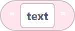
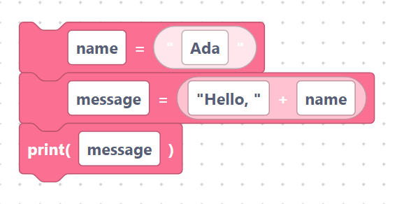

# Creating strings

The `stringInit` block makes a text value you can store or print.

## The `stringInit` block

> {width=inherit}

- **Label:** `"%1"`
- **Input:** `value` (default `text`).

Even though the block label shows quotation marks, the generator inserts your
field **exactly as typed** — it does not add quotes for you. With the default
value the generated code is:

```python
text
```

That would be read as a *variable* named `text`. To create an actual text
literal, type the quotes into the field yourself:

```python
"text"
```

## Why this matters

- `hello` → `hello` (treated as a variable name)
- `"hello"` → `"hello"` (a text literal)
- `42` → `42` (a number)

So, for real text, always include the quotes in the field.

## Worked example

```python
name = "Ada"
message = "Hello, " + name
print(message)
```

> {width=inherit}

The first two lines use string blocks (with quotes typed in); the `+` joins two
strings together.

## Next

Continue to [`upper`, `lower`, `strip`, `replace`](case.md)
