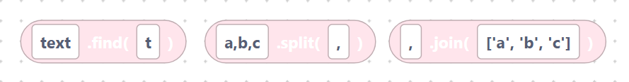
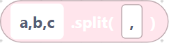
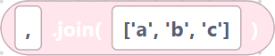
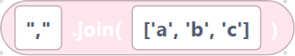
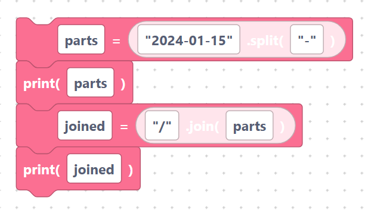

# `find`, `split`, `join`

> {width=inherit}

These blocks search inside text or convert between strings and lists. Each is a
**value block**.

As always, text fields are inserted **verbatim** — type quotes around literal text.

## The `stringFind` block

- **Label:** `%1.find(%2)` — inputs `value` (default `text`), `substring`
  (default `t`). Returns the position of the first match, or `-1` if not found.

```python
text.find(t)
```

> {width=inherit}

## The `stringSplit` block

- **Label:** `%1.split(%2)` — inputs `value` (default `a,b,c`), `delimiter`
  (default `,`). Breaks the string into a list at each delimiter.

```python
a,b,c.split(,)
```

> {width=inherit}

With quotes typed in, this becomes the more useful:

```python
"a,b,c".split(",")
```

> {width=inherit}

which produces `['a', 'b', 'c']`.

## The `stringJoin` block

- **Label:** `%1.join(%2)` — inputs `delimiter` (default `,`), `list` (default
  `['a', 'b', 'c']`). Glues a list of strings into one string.

```python
,.join(['a', 'b', 'c'])
```

> {width=inherit}

With a quoted delimiter:

```python
",".join(['a', 'b', 'c'])
```

> {width=inherit}

which produces `"a,b,c"`.

## Worked example

```python
parts = "2024-01-15".split("-")
print(parts)
joined = "/".join(parts)
print(joined)
```

> {width=inherit}

## Next

Continue to [`startswith`, `endswith`, `length`](predicate.md)
